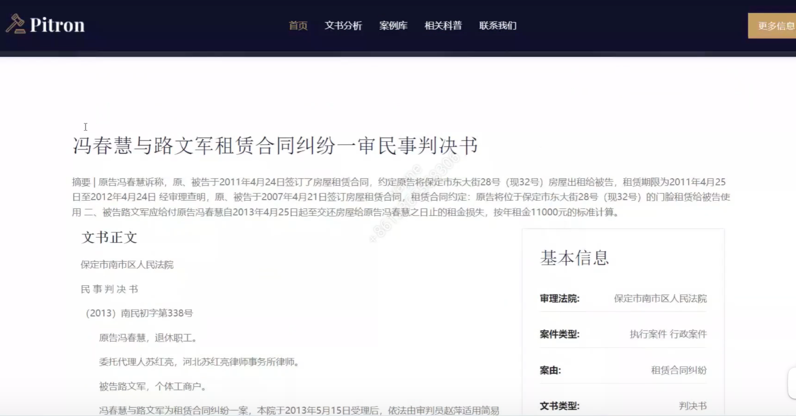
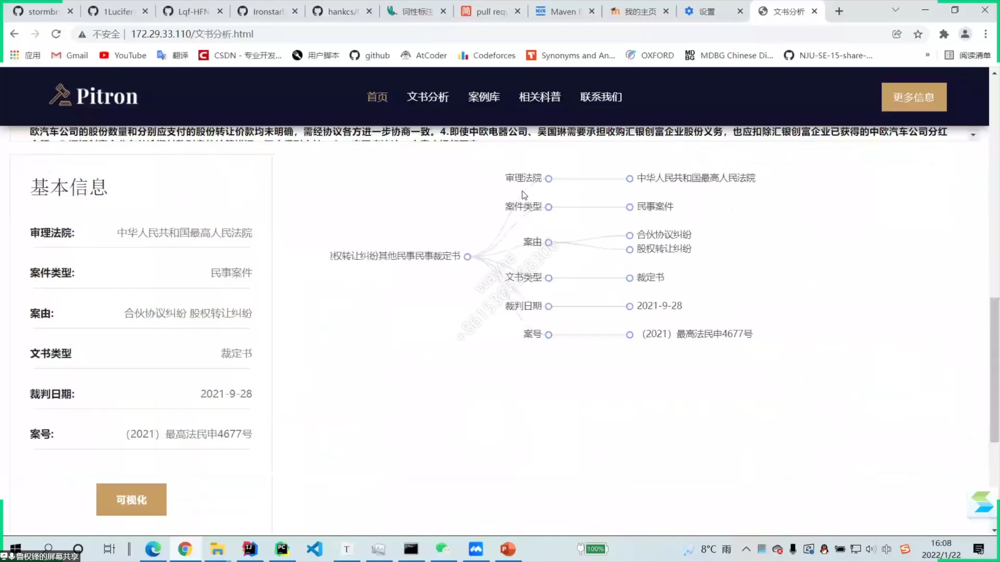
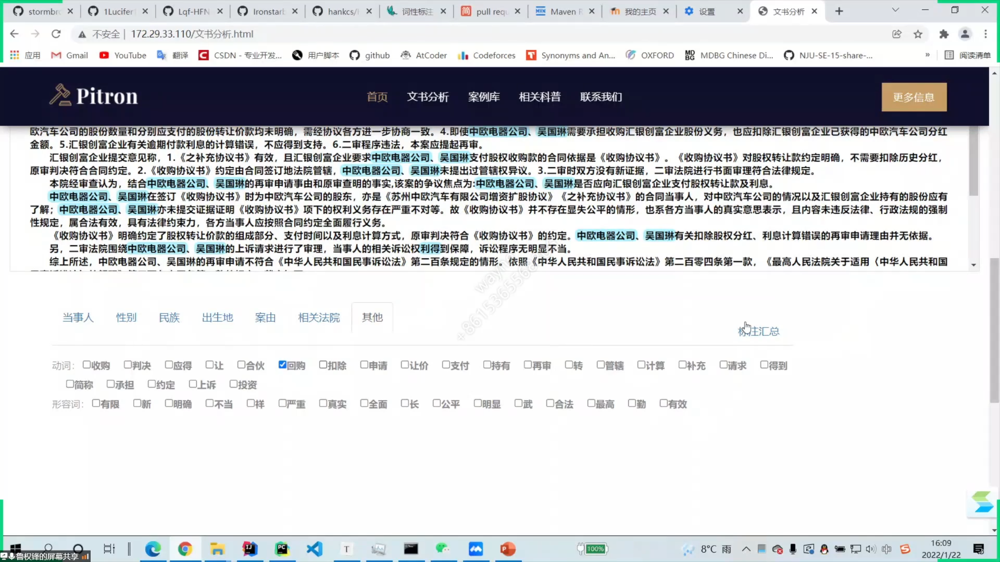
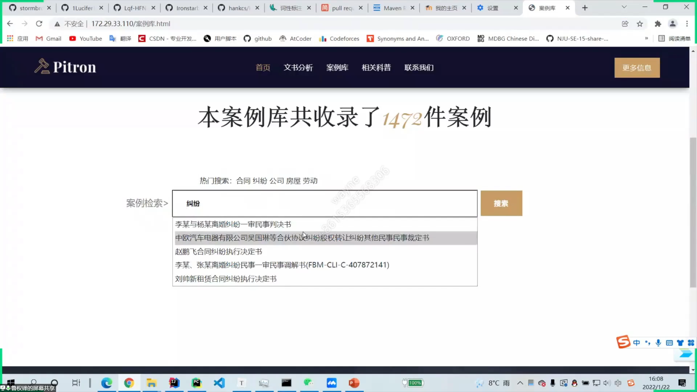

# JudicatureAutoLabel

# 功能点

司法大数据自动化标注与分析

- 犯罪信息提取与标注
  - 利用tf-idf，数百份文书作为语料库，提取关键词
  - hanlp jieba进行信息提取和词性标注
- 文书自动生成摘要
- 实时搜索建议
- 相似案例推荐，以案搜案
- 网页展示
- 北大法宝爬虫、中国裁判文书网爬虫（已失效）
- 数据可视化

# 效果展示

[效果展示视频](https://www.bilibili.com/video/BV1xF411p76H?p=13)

部分截图：

综合展示：

基本信息提取与可视化

关键词高亮、动词、形容词提取

实时搜索建议

