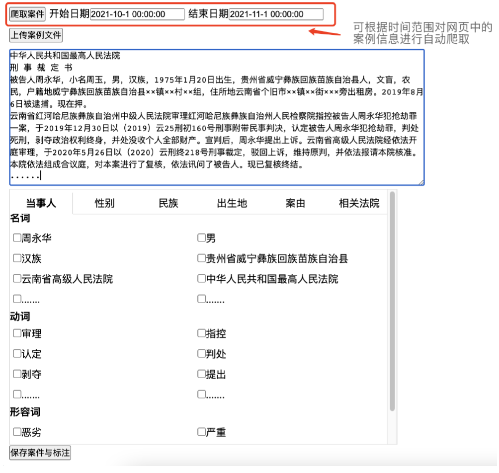

# JudicatureAutoLabel
司法大数据自动化标注与分析

实现自动化爬虫和标注工具
• 功能点：

- 用户可以在前端页面上选择选择年份以及案件数量，系统根据用户的选择自动爬取对应的数据集并保存到本地
-  用户可以在前端页面上传本地的文本或者直接输入案件信息，系统对文本内容进行自动化分词，通过文本命名实体、词性分析等方法获取基本信息可能对应的实体，并将其展示为可选项形式
- 用户可以根据需要的基本信息如当事人等，点击对应的可选项，以此对基本信息进行标注
-  用户可以点击保存按钮将案件和基本信息保存到本地，文件分别为：案件文本.txt、标注.json

